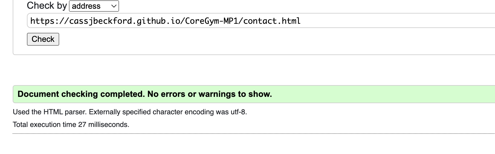

<h1 align="center">Milestone Project 1 - Core Gym</h1>

### [View The Live Project Here]()

## 

## Introduction

This the website for 'Core Gym', a made up gym located in Leigh-on-Sea, holding the function of informing new and exisiting customers on all of the key information (Location, opening times, prices, etc.). This project was created using HTML and CSS, with the intention of allowing customers the ablility to navigate through it while being responsive on multiple screen sizes

## User Experience (UX)

-  #### First Time Customer Goals

    1. As a first-time visitor I want to easily navigate through the website in order identify what services are being offered.
    2. As a first-time visitor, I want to easily find the different pricing /membership options the gym has to offer.
    3. As a first-time visitor, I want to gain a sense of what the gym is like through attractive pictures.

-   #### Returning Customer Goals

    1. As a returning visitor, I want multiple ways of getting in contact in case I need to ask for extra information.
    2. As a returning visitor, I want easy access to social media links as a means of connecting with the rest of the community.
    3. As a returning visitor, I want readily available open/close times to adjust my plans accordingly.

-   #### Frequent Customer Goals

    1. As a frequent visitor, I want to easily find any deals/offers. 
    2. As a frequent visitor, I want to easily identify what classes/ facilities are on offer to observe any changes.

### Design

-  ### Colour Scheme

      - The main colours used are bright Red, pastel Yellow, pastel Blue and Chalk. 
      - [coolors](https://coolors.co/): Coolors has been used to aid the desision the colour sceme for the project.
      ### 

-   #### Typography

     -   The main fonts on this site are Oswald and Roboto with a fall back font of sans-serif.

-   #### Imagery

    #### [Pixels](https://www.pexels.com/) : Pixels images have been used to show the interior of the shop and the staff portraits.
    
    -  Header video:

    1. [Exercise video](assets/css/media/200657-913478674_medium.mp4)

     -  About us section images:

    1. [Abount us sectionn image 1](assets/css/media/woman-6777444_640.jpg)
    2. [Abount us sectionn image 1](assets/css/media/man-8545861_640.jpg)

    - Gallert images:

    1. [couple](assets/media/couple-7437534_1920.jpg)
    2. [woman2](assets/media/gym-7705106_1920.jpg)
    3. [bikes](assets/media/sports-1962574_1920.jpg)
    4. [woman1](assets/media/gym-3516208_1920.jpg)
    5. [treadmill](assets/media/gym-526995_1920.jpg)
    6. [man1](assets/media/gym-2793007_1920.jpg)
    7. [friends](assets/media/woman-1730325_1920.jpg)
    8. [weight](assets/media/gym-2647292_640.jpg)
    9. [man2](assets/media/fitness-465205_1280.jpg)
    10. [equipment](assets/media/workout-1931107_1280.jpg)
    11. [class](assets/media/fitness-4925664_1280.jpg)
    12. [workout](assets/media/gym-6894893_640.jpg)

### Wireframes

- Main Page Wireframe - [view](docs/wireframes/Main.png)

- Contact Page Wireframe - [view](docs/wireframes/Contact.png)

- Tablet Main Page Wireframe - [view](docs/wireframes/Main-tablet.png)

- Tablet Contact Page Wireframe - [view](docs/wireframes/Contact-tablet.png)

- Mobile Main Page Wireframe - [view](docs/wireframes/Main-mobile.png)

- Mobile Contact Page Wireframe - [view](docs/wireframes/Contact-mobile.png)

## Features

## Technologies used 

## Testing

### DevTools

Desktop results. Index.html followed by contact.html

 

Mobile results. Index.html followed by contact.html

### Improvements

A consistent issue throughout seemed to be revolving around accessibility. I targetted all the link elements and gave them discernible, unique and focusable link text. Lighthouse results after improvement:

Desktop results 

 

Mobile results.

### Validator Testing 

HTML

Results No-issues

 

CSS

Results No-issues

 

Color

Results-No issues

 

### Further testing 

I have tested this site on ...

### Testing User Experience (UX)

-  #### First Time Customer Goals

    1. As a first-time visitor I want to easily navigate through the website in order identify what services are being offered.
       1. Upon entering the website, users are greeted by a navigation bar in the header that they're then able to hover over to reveal locations for them to chose from. 
       2. Just below the header is a clickable link, immediatley informing them on a deal available to them.
     
    2. As a first-time visitor, I want to easily find the different pricing /membership options the gym has to offer.
       1. Using the navigation bar, users can easily direct themselves to the memberships section, which has all the info on deals and membership prices.

    3. As a first-time visitor, I want to gain a sense of what the gym is like through attractive pictures.
      1. The video playing just below the header allows for an immediate view into the gym 
      2. The website also features a gallery, allowing a full insight into the gyms scenery and equipment.

-   #### Returning Customer Goals

    1. As a returning visitor, I want multiple ways of getting in contact in case I need to ask for extra information.
    2. As a returning visitor, I want easy access to social media links as a means of connecting with the rest of the community.
    3. As a returning visitor, I want readily available open/close times to adjust my plans accordingly.

-   #### Frequent Customer Goals

    1. As a frequent visitor, I want to easily find any deals/offers. 
    2. As a frequent visitor, I want to easily identify what classes/ facilities are on offer to observe any changes.

## Deployment 

## Credits