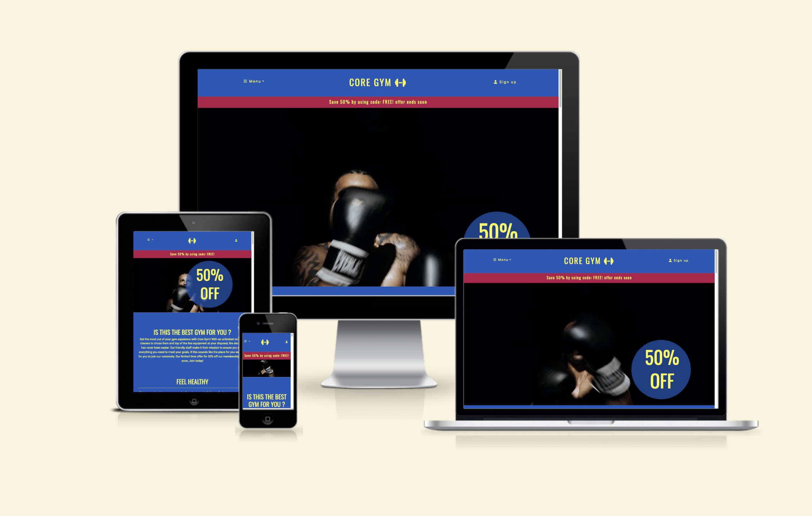
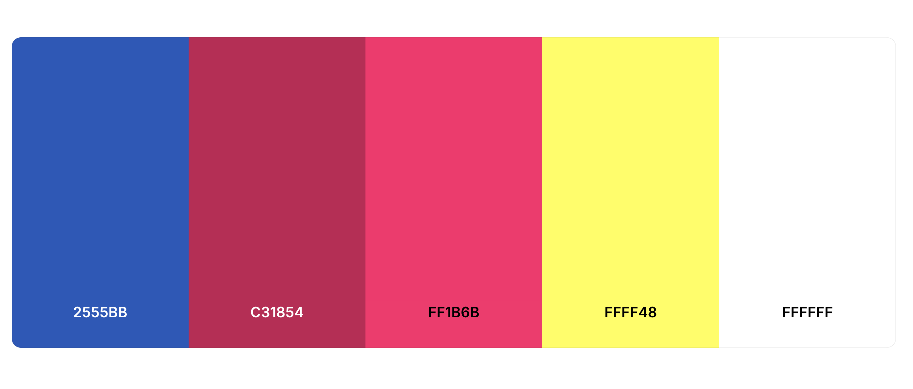
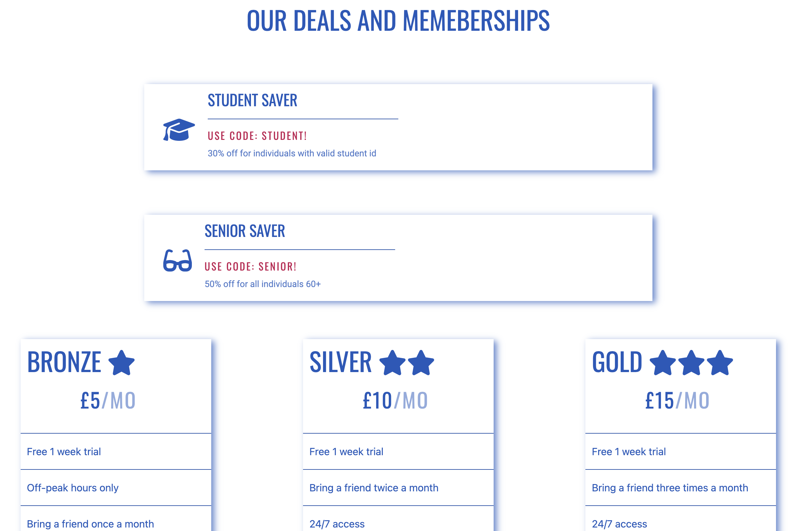
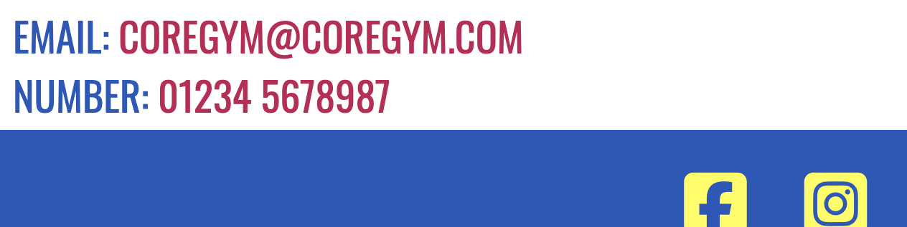
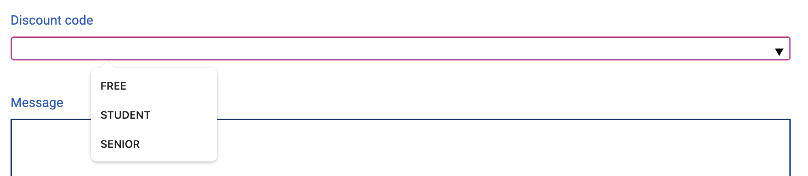

# Milestone Project 1 - Core Gym

### [View The Live Project Here](https://cassjbeckford.github.io/CoreGym-MP1/)

## 

## Introduction

This the website for 'Core Gym', a made up gym located in Leigh-on-Sea, holding the function of informing new and exisiting customers on all of the key information (Location, opening times, prices, etc.). This project was created using HTML and CSS, with the intention of allowing customers the ablility to navigate through it while being responsive on multiple screen sizes.

## Purpose and value 

The aim of my website is to attract an audience of people who value being fit and healthy, and who want to acheive this in a welcoming and inclusive space.

## User Experience (UX)

-  #### First Time Customer Goals

    1. As a first-time visitor I want to easily navigate through the website in order identify what services are being offered.
    2. As a first-time visitor, I want to easily find the different pricing /membership options the gym has to offer.
    3. As a first-time visitor, I want to gain a sense of what the gym is like through attractive pictures.

-   #### Returning Customer Goals

    1. As a returning visitor, I want multiple ways of getting in contact in case I need to ask for extra information.
    2. As a returning visitor, I want easy access to social media links as a means of connecting with the rest of the community.
    3. As a returning visitor, I want readily available open/close times to adjust my plans accordingly.

-   #### Frequent Customer Goals

    1. As a frequent visitor, I want to easily find any deals/offers. 
    2. As a frequent visitor, I want to easily identify what classes/ facilities are on offer to observe any changes.

### Design

-  ### Colour Scheme

      - The main colours used are bright Red, pastel Yellow, pastel Blue and Chalk. 
      - [coolors](https://coolors.co/): Coolors has been used to aid the desision the colour sceme for the project.
      ### 


-   #### Typography

     -   The main fonts on this site are Oswald and Roboto with a fall back font of sans-serif.

-   #### Imagery

    #### [Pexels](https://www.pexels.com/) : Pixels images have been used to show the interior of the shop and the staff portraits.
    
    -  Header video:

    1. [Exercise video](assets/media/boxing-video.mp4)

     -  About us section images:

    1. [Abount us section image 1](assets/media/woman-6777444_640.webp)
    2. [Abount us section image 2](assets/media/man-8545861_640.webp)

    - Gallery images:

    1. [couple](assets/media/couple-7437534_1920(1).webp)
    2. [woman2](assets/media/gym-7705106_1920.webp)
    3. [bikes](assets/media/sports-1962574_1920.webp)
    4. [woman1](assets/media/gym-3516208_1920.webp)
    5. [treadmill](assets/media/gym-526995_1920.webp)
    6. [man1](assets/media/gym-2793007_1920.webp)
    7. [friends](assets/media/woman-1730325_1920.webp)
    8. [weight](assets/media/gym-2647292_640.webp)
    9. [man2](assets/media/fitness-465205_1280.webp)
    10. [equipment](assets/media/workout-1931107_1280.webp)
    11. [class](assets/media/fitness-4925664_1280.webp)
    12. [workout](assets/media/gym-6894893_640.webp)


### Wireframes

- Main Page Wireframe - [view](docs/wireframes/Main.png)

- Contact Page Wireframe - [view](docs/wireframes/Contact.png)

- Tablet Main Page Wireframe - [view](docs/wireframes/Main-tablet.png)

- Tablet Contact Page Wireframe - [view](docs/wireframes/Contact-tablet.png)

- Mobile Main Page Wireframe - [view](docs/wireframes/Main-mobile.png)

- Mobile Contact Page Wireframe - [view](docs/wireframes/Contact-mobile.png)

## Technologies used 

### Languages Used

-   [HTML5](https://en.wikipedia.org/wiki/HTML5)
-   [CSS3](https://en.wikipedia.org/wiki/Cascading_Style_Sheets)

### Frameworks, Libraries & Programs Used

1. [Bootstrap 4.2:](https://getbootstrap.com/docs/5.1/getting-started/introduction/)
    - Bootstrap was used to assist with the responsiveness and styling of the website.
1. [Font Awesome:](https://fontawesome.com/)
    - Font Awesome was used on all pages to add icons forUX purposes.
1. [Google Fonts:](https://fonts.google.com/)
    - Google fonts was used for all text across the webpage
1. [jQuery:](https://jquery.com/)
    - jQuery came with Bootstrap to make the dropdown menu work.
1. [Git](https://git-scm.com/)
    - Git was used for version control by utilizing the Gitpod terminal to commit to Git and Push to GitHub.
1. [GitHub:](https://github.com/)
    - GitHub is used to store the projects code after being pushed from Git.

## Testing

### DevTools
Initial desktop results 


Initial mobile results 


### Improvements

A consistent issue throughout seemed to be revolving around accessibility. I targetted all the link elements and gave them discernible, unique and focusable link text. I also changed all jpeg image documents to webp documents. Lighthouse results after improvement:

Improved desktop results


Improved mobile results


### Validator Testing 

WC3 Markup Validator and W3C CSS Validator were used to validate the Project.

HTML
No-errors


CSS
No-errors


### Further testing 

This website was tested on:

- Google Chrome, Firefox, Microsoft Edge and Safari.
- The website was tested on multiple devices. Laptop, Ipad, Iphone 11 and Iphone 12.
- Testing has been done to ensure all elements were linking correctly. 

### Known bugs 

- Nav bar doesn't close instantly after it's been used on mobile devices. 
- Phone number appears as blue before being tapped on mobile devices. 

### Fixed bugs 

- The Hero video only played in fullscreen on ios devices. Fixed by adding a 'playsinline' attribute.

### Development process

- I started the program and repository by using the [gitpod template](https://github.com/Code-Institute-Org/gitpod-full-template) provided by the Code Insitute.  
- Then I regularly staged my changes using the command `git add <filename>` and then committed the staged changes to my local repository using `git commit -m 'short descriptive message here'`. 
- Finally, I would push the commits from my local repository up to the Github repository using the command `git push`.
- With every push, Github automatically deploys my latest commit from the 'main' branch to the Github pages.

### Testing User Experience (UX)

-  #### First Time Customer Goals

    1. As a first-time visitor I want to easily navigate through the website in order identify what services are being offered.
       1. Upon entering the website, users are greeted by a navigation bar in the header that they're then able to hover over to reveal locations for them to chose from. 
       2. The Core gym logo is a clickabke link that remains in the header of every page so the user can easily find their way to the home page.
       3. The about section is close to the top of the page, allowing for a near-immediate insight into what the gym is hoping to provide.

       - navigation
       
       - logo
       
       - about
       

    2. As a first-time visitor, I want to easily find the different pricing /membership options the gym has to offer.
       1. Using the navigation bar, users can easily direct themselves to the memberships section, which has all the info on deals and membership prices.
       
       - membership
       

    3. As a first-time visitor, I want to gain a sense of what the gym is like through attractive pictures.
       1. The video playing just below the header allows for an immediate view into the gym.
       2. The website also features a gallery, allowing a full insight into the gyms scenery and equipment.
       
       - video
       
       - gallery
       
       
-   #### Returning Customer Goals

    1. As a returning visitor, I want multiple ways of getting in contact in case I need to ask for extra information.
       1. Customers can be taken to a contact form where they can get in touch with the gym and even leave a personal message for any specific questions.
       2. Just below the opening times is the gyms main email address and phone number.
       
       - form
       
       - number/address
       
       
    2. As a returning visitor, I want easy access to social media links as a means of connecting with the rest of the community.
       1. Both the main and contact page feature social media links in the footer.
       
       - socials
       
       
    3. As a returning visitor, I want readily available open/close times to adjust my plans accordingly.
       1. Clear opening and closing times, Mon - Sun, are features at the bottom of the page above the footer.
       
       - times
       

-   #### Frequent Customer Goals

    1. As a frequent visitor, I want to easily find any deals/offers. 
       1. The memberships section features all available deals. Also the discount code section on the form presents all accessible codes.
       2. Just below the header is a clickable link, immediatley informing them on a deal available to them.

       - discounts
       
       - header link
       
    
    2. As a frequent visitor, I want to easily identify what classes/ facilities are on offer to observe any changes.
       1. The gallery features faciltities specific to Core Gym.

## Deployment 

### Github Pages

The project was deployed to GitHub Pages using the following steps...

1. Log in to GitHub and locate the [GitHub Repository](https://github.com/CassJBeckford/CoreGym-MP1)
2. At the top of the Repository (not top of page), locate the "Settings" Button on the menu.
3. Scroll down the Settings page until you locate the "GitHub Pages" Section.
4. Under "Source", click the dropdown called "None" and select "Main Branch".
5. The page will automatically refresh.
6. Scroll back down through the page to locate the now published site [link](https://github.com/CassJBeckford/CoreGym-MP1/deployments/activity_log?environment=github-pages) in the "GitHub Pages" section.


### Forking the Github repository

By forking the GitHub Repository we make a copy of the original repository on our GitHub account to view and/or make changes without affecting the original repository by using the following steps...

1. Log in to GitHub and locate the [GitHub Repository](https://github.com/CassJBeckford/CoreGym-MP1)
2. At the top of the Repository (not top of page) just above the "Settings" Button on the menu, locate the "Fork" Button.
3. You should now have a copy of the original repository in your GitHub account.


### Making a local clone 

1. Log in to GitHub and locate the [GitHub Repository](https://github.com/CassJBeckford/CoreGym-MP1)
2. Under the repository name, click "Clone or download".
3. To clone the repository using HTTPS, under "Clone with HTTPS", copy the link.
4. Open Git Bash
5. Change the current working directory to the location where you want the cloned directory to be made.
6. Type `git clone`, and then paste the URL you copied in Step 3.

```
$ git clone https://github.com/YOUR-USERNAME/YOUR-REPOSITORY
```

7. Press Enter. Your local clone will be created.

```
$ git clone https://github.com/YOUR-USERNAME/YOUR-REPOSITORY
> Cloning into `CI-Clone`...
> remote: Counting objects: 10, done.
> remote: Compressing objects: 100% (8/8), done.
> remove: Total 10 (delta 1), reused 10 (delta 1)
> Unpacking objects: 100% (10/10), done.
```

Click [Here](https://help.github.com/en/github/creating-cloning-and-archiving-repositories/cloning-a-repository#cloning-a-repository-to-github-desktop) to retrieve pictures for some of the buttons and more detailed explanations of the above process.


Alternatively, if using Gitpod, you can click below to create your own workspace using this repository.

[](https://gitpod.io/#https://github.com/CassJBeckford/CoreGym-MP1)

## Credits

## Code

- Initial gallery layout taken from [here](https://mdbootstrap.com/docs/standard/extended/gallery/)
- [font awsome](https://fontawesome.com/) for the icons used
- General coding niggles helped by [W3School](https://www.w3schools.com/)
- Google map code taken from [here](https://mdbootstrap.com/docs/b4/jquery/javascript/google-maps/) 
- Bootstrap dropdown code taken for [here](https://getbootstrap.com/docs/4.5/components/dropdowns/)
- Code institute "love running"- Loosely based my "hero-video" section on their "hero-image" section. 
- Transformed my images in webp decoments throught the site [pixelied](https://pixelied.com/convert/jpg-converter/jpg-to-webp)


# Acknowledgments

Special thanks to my Tutor- Pasquale & Mentor-Jack for their help and guidance throughout this project. As well as staff at the Greenbank Pub for being the site guinea pigs and for their constant feedback throughout the project. 